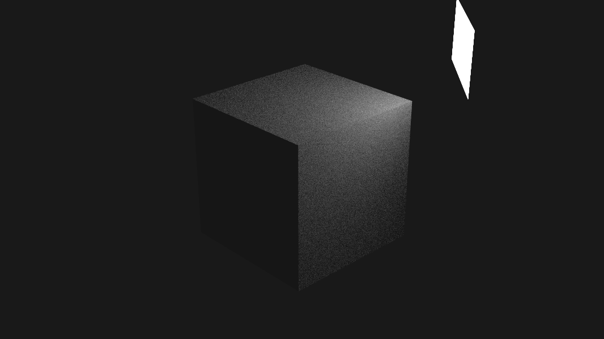

# miniray
a CPU ray tracer written in rust

it generally follows the book "Ray Tracing in One Weekend" by Peter Shirley

## Building and Running
```shell
cargo run --release
```

## Current Progress

